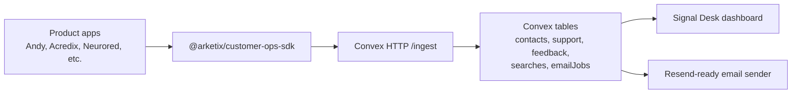

# Signal Desk

Shared support, feedback, help-search, and email operations for Arketix and Andesphere products.

## Current Status

This project is live in production and already has a dashboard UI:

- Dashboard: https://customer-ops-hub.vercel.app
- GitHub: https://github.com/Arketix/customer-ops-hub
- Production Convex: https://confident-yak-264.convex.cloud
- Production ingestion endpoint: https://confident-yak-264.convex.site/ingest

The dashboard reads production Convex data. Product apps submit standardized events to the production ingestion endpoint with `CUSTOMER_OPS_INGEST_SECRET`.

The SDK exists as a local Bun workspace package in this repo. It is private-publish ready, but it is not available to other repositories until `bun publish` is run with GitHub Packages auth configured.

## Stack

- Next.js App Router dashboard
- Convex as the source of truth
- Clerk-ready authentication
- Resend-ready transactional email queue
- HTTP ingestion contract for every product app

## How It Works



Each product sends standardized events:

- `support.ticket.created` creates a support ticket.
- `feedback.created` creates a feedback item.
- `help.search` records what users searched for in help/support.
- `email.intent.created` queues an email job.

Support and feedback are intentionally separate records. Email sending is centralized through `emailJobs`, so each product does not need its own Resend integration.

## Local Setup

```bash
bun install
bunx convex dev
bun run poc:submit
bun run dev
```

The POC script creates one Andy support ticket, one Andy help search, one Acredix feedback item, and one Acredix queued email.

## Ingestion Contract

Product apps submit events to Convex HTTP actions:

```bash
curl -X POST "$CONVEX_SITE_URL/ingest" \
  -H "Content-Type: application/json" \
  -H "Authorization: Bearer $CUSTOMER_OPS_INGEST_SECRET" \
  -d '{"eventId":"example","type":"help.search","occurredAt":0,"source":{"companyKey":"arketix","productKey":"acredix"},"search":{"query":"support","resultCount":1}}'
```

Feedback and support are separate event types and become separate records. Email intents create queued jobs, so delivery can be centralized without every app implementing Resend.

## SDK Package

The SDK lives in `packages/customer-ops-sdk` and is named `@arketix/customer-ops-sdk`.

Inside this repo, it is consumed as a Bun workspace dependency:

```json
"@arketix/customer-ops-sdk": "workspace:*"
```

That means this repo can import the package immediately without publishing it. Today, the `scripts/submit-poc.ts` script is the real consumer of that workspace SDK.

For other repositories, there are two options:

1. Publish it privately to GitHub Packages, then install `@arketix/customer-ops-sdk` in each product repo.
2. Temporarily copy the SDK source into a product repo while the contract is still changing.

Recommendation: publish privately once the first real product integration is ready. That keeps all products on one versioned client and avoids copy/paste drift. Until then, external product repos are not using the package directly.

Use it like this from product apps:

```ts
import { createCustomerOpsClient } from "@arketix/customer-ops-sdk";

const customerOps = createCustomerOpsClient({
  endpoint: process.env.CUSTOMER_OPS_ENDPOINT!,
  secret: process.env.CUSTOMER_OPS_INGEST_SECRET!,
  companyKey: "arketix",
  productKey: "acredix",
  environment: process.env.NODE_ENV,
});

await customerOps.submitFeedback({
  eventId: "feedback-123",
  contact: { email: "maria@example.com", locale: "es" },
  title: "Add export",
  message: "Please add PDF export.",
  type: "feature_request",
});
```

The same client has `submitSupportTicket`, `trackHelpSearch`, and `queueEmail`.

## Private Publishing

`packages/customer-ops-sdk/package.json` contains:

```json
"publishConfig": {
  "registry": "https://npm.pkg.github.com",
  "access": "restricted"
}
```

This means:

- `registry` tells Bun/npm to publish the package to GitHub Packages instead of the public npm registry.
- `access: restricted` means GitHub Packages should treat the package as restricted access, not public npm access.
- The package name `@arketix/customer-ops-sdk` is scoped to the Arketix GitHub organization.

Important: this only makes the package ready to publish privately. It does not publish the package, grant every repo access, or configure Vercel builds automatically.

Publishing requires GitHub Packages auth. A product repo that consumes the package will need an `.npmrc` or CI config that can read GitHub Packages:

```ini
@arketix:registry=https://npm.pkg.github.com
//npm.pkg.github.com/:_authToken=${GITHUB_PACKAGES_TOKEN}
```

After publishing, install it in a product app with Bun:

```bash
bun add @arketix/customer-ops-sdk
```

For Vercel deployments, every consuming product also needs a read token available during install. Without that, local development may work but Vercel builds will fail because the private package cannot be downloaded.

Do not publish secrets. Product apps only need:

- `CUSTOMER_OPS_ENDPOINT=https://confident-yak-264.convex.site`
- `CUSTOMER_OPS_INGEST_SECRET=<shared secret>`

## What Is Used Right Now

Right now:

- The deployed dashboard is live and reads production Convex.
- The production ingestion endpoint is live.
- The POC script uses the SDK package through the Bun workspace dependency.
- Production has seeded Andy and Acredix example events.
- No external production app imports `@arketix/customer-ops-sdk` from GitHub Packages yet.

Not done yet:

- The SDK has not been published to GitHub Packages.
- Andy, Acredix, Neurored, Business Control Room, and Wainwrights Baggers do not yet import the SDK directly.
- Product Vercel projects do not yet have GitHub Packages read-token install config.
- Resend sending is ready in code, but production email delivery still needs `RESEND_API_KEY` and `RESEND_FROM_EMAIL`.

## Product Integration Checklist

For each product:

1. Install `@arketix/customer-ops-sdk` after the private package is published.
2. Add `CUSTOMER_OPS_ENDPOINT` and `CUSTOMER_OPS_INGEST_SECRET`.
3. Send support tickets through `submitSupportTicket`.
4. Send product feedback through `submitFeedback`.
5. Send help/support searches through `trackHelpSearch`.
6. Queue standardized transactional emails through `queueEmail`.
7. Verify the event appears in https://customer-ops-hub.vercel.app.

## Dashboard UI

The production dashboard is already deployed at https://customer-ops-hub.vercel.app. It currently shows production Convex data for support tickets, feedback, contacts, queued email jobs, and help searches.

Authentication is being added with Clerk. Until the Clerk Vercel integration is fully provisioned and the production environment variables are present, the deployment should be treated as a live internal POC dashboard rather than a finished secure admin surface.
