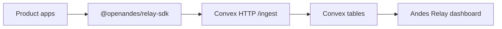

# Andes Relay

Open-source customer signal routing for SaaS products.

Andes Relay gives product teams one standard way to collect support tickets,
feedback, contact form submissions, account-created events, help searches, and
email intents across multiple apps.

This repository is designed to stay safe for public development. Deployment
accounts, personal emails, real production secrets, npm auth identities, and
company-specific operations notes should not be committed here.

It includes:

- A Clerk-protected Next.js dashboard.
- App-owned workspaces and invitations managed from the dashboard.
- A Convex backend with HTTP ingestion.
- A reusable TypeScript SDK at `packages/relay-sdk`.
- Dashboard source settings for workspace/product labels.
- A unified activity view with filters for time window, signal type, workspace,
  and product.

## How It Works



Each product sends standardized events:

- `support.ticket.created`
- `support.ticket.message`
- `contact.form.submitted`
- `user.account.created`
- `feedback.created`
- `help.search`
- `email.intent.created`
- `email.preference.updated`

Support, feedback, contact forms, account creations, help searches, and email
intents are intentionally separate records.

Each event belongs to a `workspaceKey` and `productKey`. A workspace is the
top-level operating boundary, usually one business or internal org. Products sit
inside a workspace.

## Dashboard

The dashboard has these views:

- `Activity`: one unified feed across all signal types. It defaults to the
  latest 24 hours and can show all workspaces/products.
- `Support`
- `Feedback`
- `Forms`
- `Accounts`
- `Contacts`
- `Email`
- `Search`
- `Settings`

The `Settings` view lets an operator:

- Add or update workspace display labels.
- Add or update product display labels.
- Remove workspace/product labels.
- See discovered source keys from ingested events.
- See the ingest endpoint, product environment variables, and SDK install
  command.
- Create workspaces inside Andes Relay.
- Invite workspace members from the dashboard or `/workspace`.

The direct dashboard routes are:

- `/create-workspace`: create a new workspace.
- `/workspace`: manage the selected workspace, members, and invitations.

Clerk is used for authentication only. Workspace records and invites are Andes
Relay data in Convex, not Clerk Organization records.

Removing a workspace or product in settings removes the dashboard label, not the
historical ingested events.

## Local Setup

```bash
bun install
bunx convex dev
bun run poc:submit
bun run dev
```

If the local folder or project name changes, remove `.next/` before restarting
`bun dev`. Stale Turbopack cache can otherwise fail with `Next.js package not
found`.

## Environment

Dashboard:

```bash
NEXT_PUBLIC_CONVEX_URL=
NEXT_PUBLIC_CONVEX_SITE_URL=
NEXT_PUBLIC_CLERK_PUBLISHABLE_KEY=
CLERK_SECRET_KEY=
NEXT_PUBLIC_CLERK_SIGN_IN_URL=/sign-in
NEXT_PUBLIC_CLERK_SIGN_UP_URL=/sign-up
```

Ingestion:

```bash
ANDES_RELAY_INGEST_SECRET=
```

Product apps need server-side environment variables:

```bash
ANDES_RELAY_ENDPOINT=https://your-convex-site.convex.site
ANDES_RELAY_INGEST_SECRET=<shared secret>
```

Keep `ANDES_RELAY_INGEST_SECRET` server-side only. Do not expose it in browser
code.

## SDK Package

The SDK lives in `packages/relay-sdk` and is named `@openandes/relay-sdk`.

Inside this repo it is consumed as a Bun workspace dependency:

```json
"@openandes/relay-sdk": "workspace:*"
```

Product apps install it with Bun after publishing:

```bash
bun add @openandes/relay-sdk
```

Example:

```ts
import { createAndesRelayClient } from "@openandes/relay-sdk";

const relay = createAndesRelayClient({
  endpoint: process.env.ANDES_RELAY_ENDPOINT!,
  secret: process.env.ANDES_RELAY_INGEST_SECRET!,
  workspaceKey: "acme",
  productKey: "web",
  environment: process.env.NODE_ENV,
});

await relay.submitContactForm({
  eventId: "contact-123",
  contact: { email: "user@example.com", locale: "en" },
  subject: "Pricing question",
  message: "Can we talk about pricing?",
  company: "Example Co",
});
```

The client exposes:

- `submitEvent`
- `submitSupportTicket`
- `submitFeedback`
- `submitContactForm`
- `trackAccountCreated`
- `trackHelpSearch`
- `queueEmail`

## Direct HTTP Ingestion

```bash
curl -X POST "$ANDES_RELAY_ENDPOINT/ingest" \
  -H "Content-Type: application/json" \
  -H "Authorization: Bearer $ANDES_RELAY_INGEST_SECRET" \
  -d '{
    "eventId":"example-help-search-1",
    "type":"help.search",
    "occurredAt":1770000000000,
    "source":{"workspaceKey":"acme","productKey":"web"},
    "search":{"query":"billing","resultCount":3}
  }'
```

`workspaceKey` and `productKey` are stable source slugs. You can rename their
display labels from the dashboard Settings view without changing product code.
For rollout compatibility, the ingest API still accepts the previous
`companyKey` source field as an alias for `workspaceKey`.

## Publishing

`packages/relay-sdk/package.json` is configured for a public scoped package:

```json
"publishConfig": {
  "access": "public"
}
```

Before publishing, build and typecheck the package:

```bash
bun run build:sdk
bun run typecheck:sdk
```

Publish with Bun from a machine logged in to the npm account that owns the
package scope:

```bash
bun publish --cwd packages/relay-sdk
```

Do not commit npm tokens or account-specific publishing details. Keep those in
local ignored operations notes.

## Verification

```bash
bun run check
bun run poc:submit
```

`bun run poc:submit` submits generic sample events through the SDK and prints
the dashboard overview.

## License

MIT
