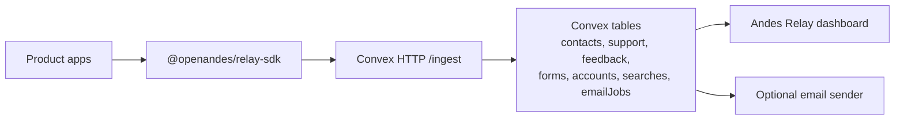

# Andes Relay

Open-source customer signal routing for SaaS products.

Andes Relay gives product teams one standard way to collect support tickets, feedback, contact form submissions, account-created events, help searches, and email intents across multiple apps.

This repository is the first OpenAndes project. It includes a Next.js dashboard, a Convex backend, and a reusable TypeScript SDK.

## Status

This project is already running as the first real use case across Jorge Mena's production products:

- Dashboard: https://customer-ops-hub.vercel.app
- GitHub: https://github.com/Arketix/customer-ops-hub
- Production Convex: https://confident-yak-264.convex.cloud
- Production ingestion endpoint: https://confident-yak-264.convex.site/ingest

Current production examples:

- `acredix.cl` sends contact form submissions into Andes Relay.
- `andypartner.com` sends Clerk account-created events into Andes Relay.

## Stack

- Next.js App Router dashboard
- Convex source-of-truth backend
- Clerk authentication
- Resend-ready transactional email queue
- Public TypeScript SDK
- HTTP ingestion contract for any product app

## How It Works



Each product sends standardized events:

- `support.ticket.created` creates a support ticket.
- `support.ticket.message` adds a support ticket message.
- `contact.form.submitted` records a public contact form submission.
- `user.account.created` records a new account/user signup.
- `feedback.created` creates a feedback item.
- `help.search` records what users searched for in help/support.
- `email.intent.created` queues an email job.
- `email.preference.updated` updates contact email preferences.

Support and feedback are intentionally separate records. Contact forms and account creations are also first-class records, because those signals answer different operational questions.

## Local Setup

```bash
bun install
bunx convex dev
bun run poc:submit
bun run dev
```

`bun run poc:submit` submits sample events for the first real use case: an Andy account event, Andy support/search events, an Acredix contact form, Acredix feedback, and an Acredix email intent.

## Environment

Dashboard:

```bash
NEXT_PUBLIC_CONVEX_URL=
NEXT_PUBLIC_CLERK_PUBLISHABLE_KEY=
CLERK_SECRET_KEY=
NEXT_PUBLIC_CLERK_SIGN_IN_URL=/sign-in
NEXT_PUBLIC_CLERK_SIGN_UP_URL=/sign-up
```

Ingestion:

```bash
NEXT_PUBLIC_CONVEX_SITE_URL=
ANDES_RELAY_INGEST_SECRET=
```

`CUSTOMER_OPS_INGEST_SECRET` is still accepted as a temporary compatibility fallback for the first production integrations.

Product apps only need:

```bash
ANDES_RELAY_ENDPOINT=https://your-convex-site.convex.site
ANDES_RELAY_INGEST_SECRET=<shared secret>
```

## Ingestion Contract

Product apps submit events to the Convex HTTP action:

```bash
curl -X POST "$ANDES_RELAY_ENDPOINT/ingest" \
  -H "Content-Type: application/json" \
  -H "Authorization: Bearer $ANDES_RELAY_INGEST_SECRET" \
  -d '{"eventId":"example","type":"help.search","occurredAt":0,"source":{"companyKey":"acme","productKey":"web"},"search":{"query":"support","resultCount":1}}'
```

`companyKey` and `productKey` are plain strings. Use stable slugs such as `acme`, `acme-web`, `mobile-app`, or `docs`.

## SDK Package

The SDK lives in `packages/relay-sdk` and is named `@openandes/relay-sdk`.

Inside this repo, it is consumed as a Bun workspace dependency:

```json
"@openandes/relay-sdk": "workspace:*"
```

Use it from product apps like this:

```ts
import { createCustomerOpsClient } from "@openandes/relay-sdk";

const relay = createCustomerOpsClient({
  endpoint: process.env.ANDES_RELAY_ENDPOINT!,
  secret: process.env.ANDES_RELAY_INGEST_SECRET!,
  companyKey: "acme",
  productKey: "web",
  environment: process.env.NODE_ENV,
});

await relay.submitContactForm({
  eventId: "contact-123",
  contact: { email: "maria@example.com", locale: "es" },
  subject: "Pricing question",
  message: "Can we talk about pricing?",
  company: "Acme SpA",
});
```

The same client has `submitSupportTicket`, `submitFeedback`, `submitContactForm`, `trackAccountCreated`, `trackHelpSearch`, and `queueEmail`.

## Public Publishing

`packages/relay-sdk/package.json` is configured for a public scoped npm package:

```json
"publishConfig": {
  "access": "public"
}
```

Publish with Bun after the package name/scope is confirmed:

```bash
bun publish --cwd packages/relay-sdk
```

Then install it in product apps with Bun:

```bash
bun add @openandes/relay-sdk
```

## First Use Case

The first production use case is Jorge Mena's own products:

- Arketix / Acredix: `https://acredix.cl/api/contact` sends `contact.form.submitted`.
- Andesphere / Andy Partner: Clerk `user.created` webhooks send `user.account.created`.

That gives Andes Relay a real portfolio story: it is not a toy dashboard; it is running against production SaaS surfaces and centralizing customer signals across companies.

## Product Integration Checklist

For each product:

1. Install `@openandes/relay-sdk` after publishing, or submit directly to `/ingest` while the SDK is local.
2. Add `ANDES_RELAY_ENDPOINT` and `ANDES_RELAY_INGEST_SECRET`.
3. Send support tickets through `submitSupportTicket`.
4. Send public contact forms through `submitContactForm`.
5. Send account-created events through `trackAccountCreated`.
6. Send product feedback through `submitFeedback`.
7. Send help/support searches through `trackHelpSearch`.
8. Queue standardized transactional emails through `queueEmail`.
9. Verify the event appears in the Andes Relay dashboard.

## License

MIT
